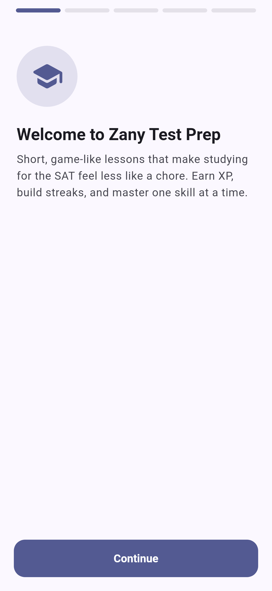
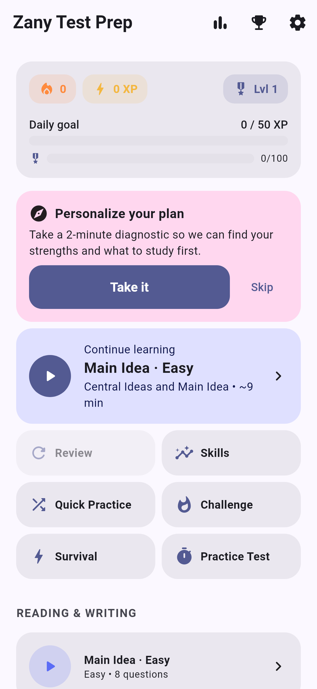
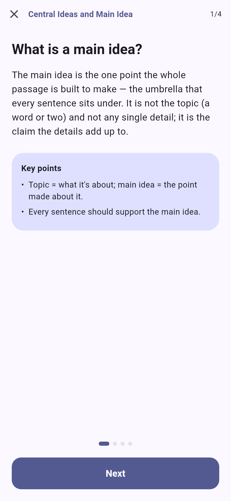
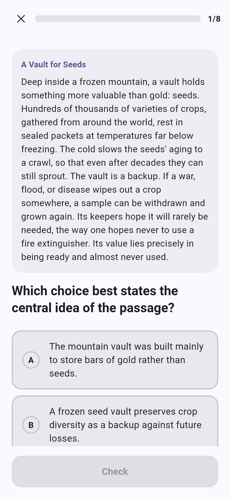
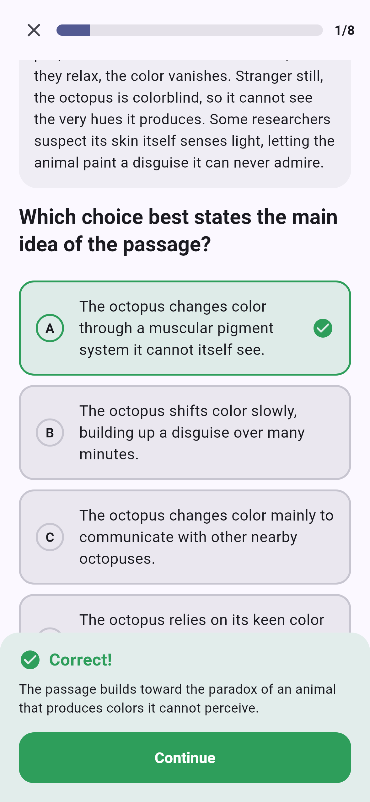
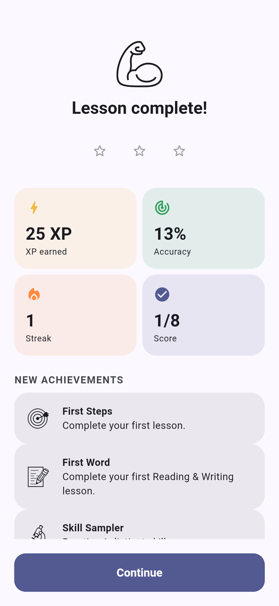
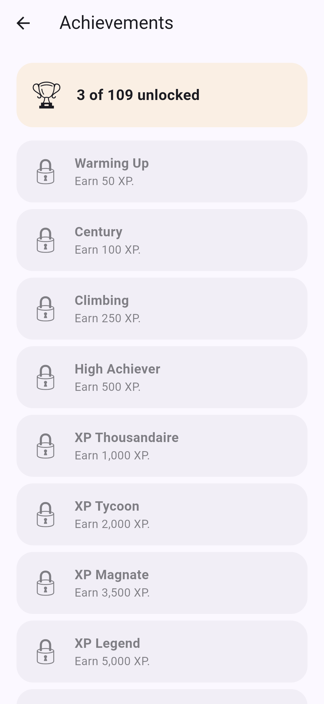
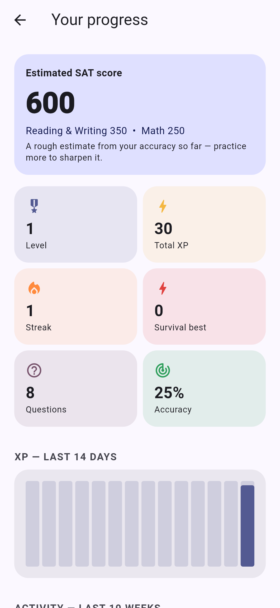

# Zany Test Prep

An **offline-first, Duolingo-style SAT prep app** built in Flutter. Short
5–15 minute challenge lessons, gamified progression (XP, levels, streaks,
mastery, badges, crowns), and a full review system — all working **completely
offline after install**. No backend, no login, no network.

- **Platform:** Android-first, architected cross-platform (iOS/web/desktop ready).
- **Content:** 50 original SAT-style lessons and 1,003 original questions
  (500 Math, 503 Reading & Writing). No copyrighted College Board material.
- **Stack:** Flutter (stable, 3.35.5), Material 3, Riverpod, GoRouter,
  `shared_preferences` persistence.

> The data model is **exam-agnostic** (`exam_id`/`domain`/`section`/`skill`/…),
> so ACT and AP exams can be added later without reworking the app.

## Screenshots

| Onboarding | Home / Path | Teaching card | Question |
| --- | --- | --- | --- |
|  |  |  |  |

| Instant feedback | Lesson complete | Achievements | Progress dashboard |
| --- | --- | --- | --- |
|  |  |  |  |

> Screenshots are generated headlessly from the real app via
> `flutter test --tags screenshots` (see `test/screenshots/`).

## Quick start

The whole toolchain is isolated to this repo. A [mamba](https://mamba.readthedocs.io/)
environment (`zany-test-prep`) provides JDK 17 + Python content tooling, and the
Flutter SDK + Android SDK are installed into a git-ignored `.tooling/` directory.

```bash
# 1. One-time setup: mamba env + Flutter 3.35.5 + Android SDK into .tooling/
bash scripts/setup_env.sh

# 2. Every shell: put flutter/dart/java/sdkmanager on PATH
source scripts/activate.sh

# 3. Sanity check the toolchain
flutter doctor

# 4. Run the app (device/emulator attached)
flutter run
```

If you already have a working Flutter + JDK 17 + Android SDK on your machine, you
can skip `setup_env.sh`/`activate.sh` and use your own toolchain.

## Common commands

```bash
# Validate the offline content bank (schema + referential + answer checks)
python tools/validate_content.py

# Regenerate the canonical content JSON under content/exams/sat/
python tools/generate_content.py

# Rebuild the app asset bundle (assets/content/sat.bundle.json)
python tools/build_bundle.py

# Run unit + widget tests
flutter test

# Run the integration test (launch → onboard → lesson → persist)
flutter test integration_test

# Build a release APK
flutter build apk --release
# -> build/app/outputs/flutter-apk/app-release.apk

# Build a debug APK
flutter build apk --debug
# -> build/app/outputs/flutter-apk/app-debug.apk
```

> The content pipeline order is **generate → validate → bundle**. CI rebuilds the
> bundle and fails if the committed `assets/content/` is stale, so always run
> `python tools/build_bundle.py` and commit the result after changing content.

## Building & shipping an APK

- **Local build:** `flutter build apk --release` produces
  `build/app/outputs/flutter-apk/app-release.apk`. By default this is
  **debug-signed**, which is fine for private/internal distribution.
- **CI artifacts:** GitHub Actions builds and uploads APKs automatically — see
  [docs/release.md](docs/release.md). Debug APKs are produced on every push to
  `master`; release APKs are produced on `v*` tags.
- **Private release:** tag a commit `vX.Y.Z` and push the tag. The Release
  workflow builds a release APK (and a best-effort `.aab`) and attaches it to a
  GitHub Release. Full steps in [docs/release.md](docs/release.md).

## Project structure

```text
.
├── lib/                     # Flutter app source
│   ├── main.dart            # entrypoint
│   ├── app/                 # AppController (Riverpod), GoRouter, root widget
│   ├── domain/
│   │   ├── models/          # exam-agnostic models (question, lesson, profile, progress…)
│   │   └── services/        # game engines (xp/level, streak, mastery, review, unlock, badges…)
│   ├── data/
│   │   ├── local/           # KeyValueStore interface + shared_preferences impl
│   │   └── repositories/    # content + progress repositories
│   ├── design/              # Material 3 theme + shared widgets
│   └── features/            # UI per feature (onboarding, home, lessons, review, …)
├── content/                 # canonical, exam-agnostic content (source of truth)
│   ├── exams/sat/           # exam.yaml, skills.yaml, lessons/, questions/, manifest.json
│   ├── schemas/             # question.schema.json, lesson.schema.json
│   ├── prompts/             # reusable AI content-generation prompts
│   └── validators/          # validator docs
├── tools/                   # Python content pipeline
│   ├── generate_content.py  # regenerate the SAT content bank
│   ├── validate_content.py  # schema + referential + answer validation (runs in CI)
│   ├── build_bundle.py      # build assets/content/<exam>.bundle.json
│   └── content_gen/         # deterministic generators (math, rw, passages, teaching)
├── assets/content/          # built bundles the app loads at runtime (generated)
├── scripts/                 # setup_env.sh, activate.sh
├── .github/workflows/       # ci.yml, android-apk.yml, release.yml
└── docs/                    # this documentation set
```

## Documentation

| Doc | What's inside |
| --- | --- |
| [docs/architecture.md](docs/architecture.md) | App layers, Riverpod state, GoRouter navigation, content loading |
| [docs/content.md](docs/content.md) | Content schemas field-by-field, question types, the pipeline |
| [docs/persistence.md](docs/persistence.md) | Storage keys, JSON shapes, reset behavior, offline guarantees |
| [docs/gamification.md](docs/gamification.md) | XP, levels, streaks, daily goals, mastery, review, badges, crowns — with formulas |
| [docs/content-authoring.md](docs/content-authoring.md) | Adding SAT lessons/questions, adding a new exam (ACT/AP), the workflow |
| [docs/release.md](docs/release.md) | GitHub Actions workflows, cutting a private release, signing secrets |
| [docs/roadmap.md](docs/roadmap.md) | Known limitations and the future roadmap |

## Privacy

The app stores all progress **locally on the device** (via
`shared_preferences`). It has no backend, requires no account, and makes no
network requests. Resetting progress from Settings wipes the local data.

## Content note

All SAT practice content in this repository is **original, SAT-style** material,
generated or authored for this project. It contains **no copyrighted College
Board questions** or official test-prep material.
